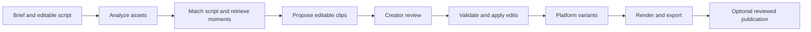

# Agents and durable creator workflows

Status: implementation baseline selected. Use LangGraph Python with Postgres checkpoints, executed in Celery worker segments. [technical_stack.md](technical_stack.md) defines the integration boundaries. Tools and graph behavior are not implemented yet.

## What makes this an agent

An agent has a concrete objective, typed tools, observable results, persistent task state, and a bounded ability to choose its next action. It can notice insufficient evidence, request a denser inspection, revise its plan, and stop for creator input. Retrieval is one tool it may use; retrieval alone is not the agent.

Use deterministic workflows for media extraction, validation, and rendering. Use agent decisions for interpretation and editorial choices. A model does not need to decide how to run ffprobe, whether a time range is out of bounds, or how to retry an expired storage URL.

## Recommended initial organization

Start with one coordinator and explicit workflow stages, not a swarm of independent personalities. Writing, footage research, and edit planning can be role-specific subroutines of the same durable run. Separate them into agents only when independent evaluation or tool policies justify it.

The analysis stage can run as fixed jobs. Within matching/planning, the coordinator chooses among evidence tools, observes their results, and performs bounded refinement. The creator sees useful progress and proposed artifacts rather than internal role conversations.

## Frameworks considered during research

| Option | Good fit | Limits and setup implications |
| --- | --- | --- |
| [LangGraph](https://docs.langchain.com/oss/python/langgraph/overview) | Explicit state graph, branching tool loops, persistent checkpoints and review pauses; fits a Python media backend | Requires implementing tools and job execution. A graph is not a GPU queue. Use the library in our own service; hosted products have separate deployment terms |
| [Inngest](https://www.inngest.com/docs/durable-execution) with [AgentKit](https://agentkit.inngest.com/concepts/agents) where needed | Event-driven steps, retries and waits; attractive for a TypeScript-first team | Still needs dedicated media workers. Compare local and deployed runtime behavior and boundaries before choosing |
| [Temporal](https://docs.temporal.io/) | Durable long-running infrastructure if operations become more demanding | More infrastructure/learning than we need to prove the first creator flow |

Final choice: LangGraph Python library for the adaptive agent, Celery/Valkey for work delivery, and Postgres for checkpoints and product-visible run/job state. Inngest and Temporal remain research alternatives, not active dependencies. LangGraph state and Celery work delivery solve different responsibilities; do not use Celery as a second editorial workflow engine.

[LangGraph persistence](https://docs.langchain.com/oss/python/langgraph/persistence) distinguishes per-run checkpoints from longer-lived stores. [Interrupts](https://docs.langchain.com/oss/python/langgraph/interrupts) support pausing for external input. Replayed node code can execute again, so side effects need idempotency even when checkpoints exist. These capabilities were verified in docs, not exercised in CreatorAi.

## Proposed tool contracts

| Tool | Input | Observable result |
| --- | --- | --- |
| search_assets | Project filter, query, evidence type | Authorized asset/window identifiers, ranked results, coverage state |
| read_transcript | Asset and source time range | Words, timing, utterances, available quality flags |
| inspect_video_window | Asset, source range, question, sampling budget | Timestamped observations and uncertainty |
| match_script_beats | Versioned script and candidate evidence | Matches, alternatives, missing beats |
| propose_clip | Source references, intent, output format | Validated candidate edit document with provenance |
| apply_edit_operations | Expected project version and typed operations | New immutable revision or a version conflict |
| render_preview | Revision, preset | Job ID, status, preview artifact |
| validate_variant | Revision and versioned platform preset | Concrete layout/media issues |
| export_variant | Reviewed revision and preset | Export job and downloadable artifact |

Publication is a later tool with an explicit destination, creator authorization, and a saved provider result. Tools take asset identifiers and validated structured arguments. They do not accept arbitrary shell commands from the model.

## Example of adaptive behavior

Request: make a short clip of the actual camera demonstration, with the explanation that goes with it.

The agent searches demonstration candidates, reads the associated transcript, and inspects a video window. If it finds speech about the feature but no visible demonstration, it searches nearby B-roll or another asset. It expands the successful window to include the setup and payoff, proposes an editable draft, and reports a missing visual if none exists. It does not fabricate footage or silently label a transcript match as visual proof.

## State and reliability

Persist project ID, script and asset versions, evidence identifiers, candidate revisions, completed tool results, job IDs, budget, coverage, and creator decisions. Store bytes in object storage, not model messages or checkpoint blobs. Long-lived creator preferences are separate from task state.

Bound the run: maximum tool calls, visual windows, tokens, elapsed time, and cost. Retry transient failures with limits; do not retry an invalid script match indefinitely. A job waiting for review should not hold a GPU worker. Cancellation stops future work, while preserving completed derivatives for reuse.

Use stable idempotency keys for external effects and render jobs. Checkpointing does not guarantee exactly-once publication. Persist the external ID and reconcile uncertain provider responses before retrying.

Every proposed edit names its source and expected project revision. If the creator edits while an agent runs, stage the agent's proposal for reconciliation; never replace a newer project automatically. Original assets remain immutable.

## Quick setup spike

1. Create one persisted run with a few fixed graph stages and a narrowly bounded evidence-search loop.
2. Implement search_assets, read_transcript, inspect_video_window, and propose_clip against the same asset index.
3. Add a creator review pause that resumes with selection or edit feedback.
4. Dispatch a render job outside the graph request and resume from its result.
5. Expose simple progress events to the UI: matching material, preparing drafts, ready for review.
6. Restart a worker mid-run and verify completed extraction is reused, edits remain versioned, and effects are not duplicated.

Quick framework setup is feasible. Reliable semantic matching, editable rendering, and real creator usefulness still require engineering and evaluation; installing an agent framework does not complete those parts.

No agent runtime, packages, services, or API credentials were installed during this planning pass.
