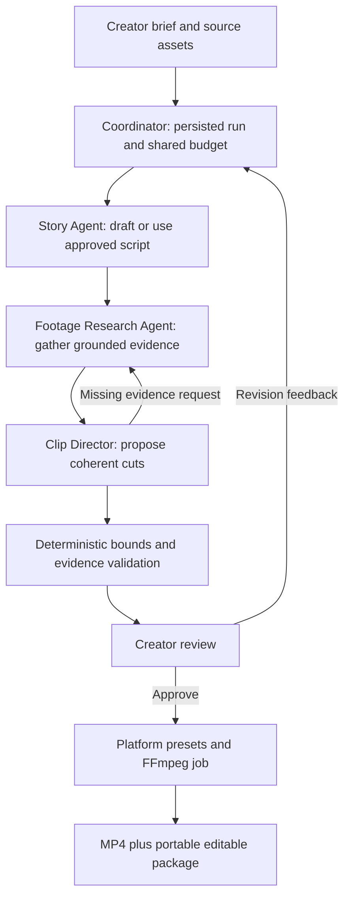

# Multi-agent creator workflow

Updated: 4 October 2026. This is the target architecture, not a claim that multiple agents are already implemented. This document and product_requirements.md define the current direction; earlier single-agent/editor plans are superseded.

## Current implementation versus target

Today, CreatorAi has one LangGraph clip agent with a tool loop, durable checkpoints and creator review. Story drafting and footage indexing are separate model calls/jobs, not independently acting agents. Multiple tools, prompts or worker processes do not make that implementation multi-agent.

The next increment introduces three specialist agents with distinct objectives, restricted tools, local state and explicit handoffs. They may share one Gemini adapter, one worker and one deployment. Multi-agent describes responsibility and execution, not the number of servers or different model providers.

## Agent responsibilities

| Agent | Objective and tools | Output / boundary |
| --- | --- | --- |
| Story Agent | Read the brief and available source facts; generate or revise hooks, script and supporting copy | Versioned StoryDraft. Cannot claim unsourced facts or silently replace the creator's approved story |
| Footage Research Agent | Search the saved asset index, retrieve timestamped speech and inspect selected visual windows; resolve evidence requests | EvidenceBundle with asset/range references, quotes, actual observations, uncertainty and missing matches. Cannot author the final cut or mutate originals |
| Clip Director | Read the approved story and evidence; choose coherent moments; request missing evidence from Research; propose/revise source-grounded cuts | ClipPlan with candidates, rationale and source references. Cannot treat a requested script line as spoken footage or fabricate a missing shot |

A coordinating LangGraph workflow routes tasks, enforces budgets and persists handoffs. The coordinator does not need its own model call when the route is known. Role-specific subgraphs provide separate context/tool policies, decision loops and resumable state. These are substantive agents only when they choose actions and evaluate tool results; renaming fixed prompts into agent classes does not meet the acceptance criteria.

A dedicated quality-review agent is optional later, after we establish a useful independent checking task. Do not add agents merely to increase the count. Platform presets, validation, extraction and FFmpeg rendering remain deterministic services/jobs.

## Flow and feedback

Script-first: Story proposes a draft, the creator approves it, then Research checks what the footage actually supports. Footage-first: Research collects facts first; Story drafts from those facts before Director proposes cuts. An existing approved script skips drafting. Cached evidence skips redundant analysis. The coordinator routes revision feedback to the responsible agent rather than rerunning every stage.

If Director needs another take or cannot verify a visual, it emits an EvidenceRequest. Research returns new evidence or an explicit missing-match result. Cap this feedback loop. Stop for the creator when the material cannot support the requested output.

## Explicit handoff contracts

All handoffs are schema-validated persisted records, not freeform agent chat:

- RunContext: owner/project/run IDs, requested goal, source and story versions, remaining budget and decision history.
- StoryDraft: hooks, script, supporting copy, source references, revision and creator approval status.
- EvidenceRequest: story beat or candidate range, specific unresolved question and remaining inspection budget.
- EvidenceBundle: source asset/version, transcript ranges/quotes, inspected-window observations, coverage/uncertainty and analysis provenance.
- ClipPlan: candidate IDs, source in/out points, supporting evidence IDs, story connection, caption/crop instructions and review status.
- ExportPlan: approved candidate/revision, explicit preset and structured media operations; consumed by deterministic rendering code.

Freeze input versions. Agent proposals never overwrite newer creator work. Record who produced each artifact, its upstream inputs and the tools used. Checkpoint state stores references and compact relevant results, not repeated full footage.

## Free-tier execution and permissions

Keep the existing database queue and one designated worker for a shared Supabase demo. LangGraph owns coordination/agent state; workers execute it. Celery, Redis, paid agent hosting and GPU services are not prerequisites.

Carry a shared request/tool/inspection budget across all agent handoffs. Do not give each specialist the entire old single-agent budget. Initial clip-run target: at most six reasoning calls across the specialists, eight tool calls and two visual-window inspections, with the existing request spacing. An uncached index or explicitly requested story draft is separately accounted for. Persist usage by agent and for the whole run; free quota limits still apply.

Agents use allowlisted typed tools; no shell, arbitrary SQL, broad filesystem access or direct publication. Deterministic code checks ownership, timing bounds, evidence coverage and render settings. A provider quota/unavailable failure stops safely; no automatic model retry or paid fallback. Stop future work on cancellation and retain compatible completed evidence.

## Next implementation steps and completion checks

1. Extract the current clip agent's search/inspection behavior into a Research subgraph and its selection/proposal behavior into a Director subgraph.
2. Convert Story generation into a bounded tool-using drafting/revision subgraph; reuse the existing generation adapter rather than installing another framework.
3. Introduce the typed handoff records and a coordinator; migrate their persistence deliberately.
4. Route creator feedback, checkpoint each handoff and surface useful activity such as gathering evidence or revising a cut.
5. Verify with mocked models first; use only a small explicit live check when needed.

Acceptance: Director requests missing evidence and Research answers or reports a gap; a restart resumes the correct specialist; creator revisions affect only the necessary stages; all stages share one budget; output artifacts retain source evidence and agent provenance. A diagram or three sequential prompts alone does not pass.

The inbuilt video/image editor is out of scope. Review, approval, revision requests and external-editable output are required; manual timeline/canvas editing is not.
