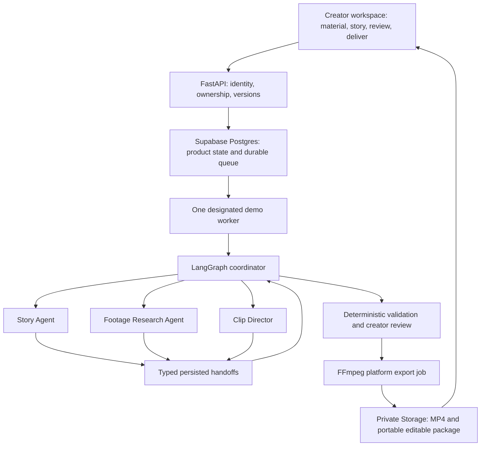

# Architecture and next delivery increment

Updated: 4 October 2026. The core demo is implemented with one clip agent. The next scope is multi-agent coordination and candidate review/export; an inbuilt editor is excluded.

## Target architecture

This is a target diagram. Current code has one clip graph, fixed drafting/indexing jobs and a database worker. Sharing a model, worker or service does not prevent distinct specialist agents; giving tasks different labels does not establish them either.

## Preserve the existing base

Retain ownership checks, immutable assets, cached timestamped evidence, private links, revision-controlled output documents, database queue leases, LangGraph checkpoints and deterministic exports. The earlier application stays archived. Do not introduce brokers/GPU hosting/editor packages to perform this increment.

## Next increment

1. Split evidence gathering and editorial selection into Research and Director subgraphs, each with restricted tools and local state.
2. Give Story a bounded drafting/revision tool loop and explicit approval/version contract.
3. Add the coordinating graph and typed handoff persistence; decide whether new fields require an Alembic migration before changing storage.
4. Implement missing-evidence requests and responsible-agent routing for creator feedback. Enforce one global budget rather than multiplying limits per agent.
5. Focus the interface on source preview, candidate evidence, approve/reject, revision requests and export. Manual timeline/canvas editing is not part of acceptance.
6. Test handoffs, restart recovery, conflicting input versions, budget exhaustion and selective reruns with mocked models before one limited live check.

Completion: a Research-to-Director exchange is visible in persisted activity; Director can request missing evidence; a checkpoint resumes the correct agent; creator feedback does not regenerate unrelated work; the approved result renders and includes portable source instructions.

## Following increments

Verify the public Vercel/Render release. Improve timing/alignment and framing on representative footage. Verify an external-editor interchange format only if requested; the current ZIP is not a native editor project. Add publication/scheduling and Creator Intelligence later.
