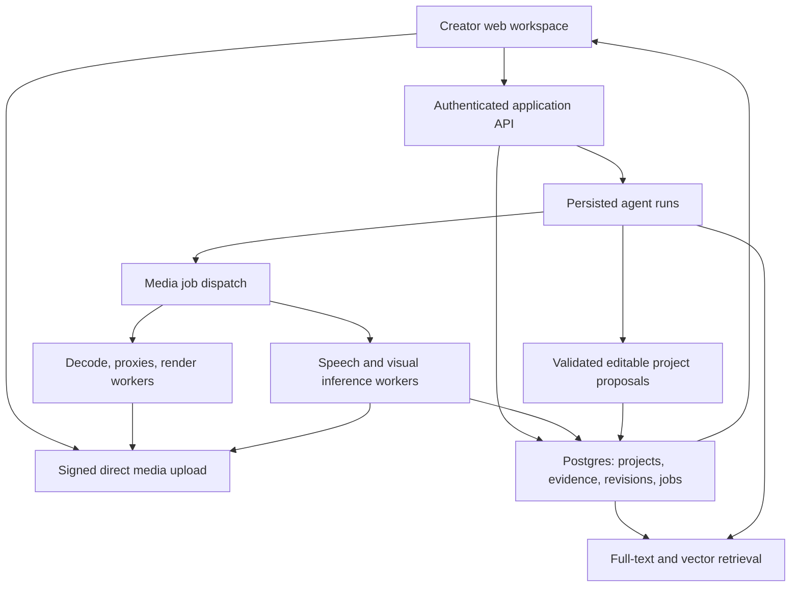

# Architecture and delivery plan

Updated: 4 October 2026. The first local project/brief increment is implemented. [prototype_budget.md](prototype_budget.md) takes precedence over the earlier paid deployment assumptions. Stack/service boundaries remain in [technical_stack.md](technical_stack.md); [deployment_plan.md](deployment_plan.md) describes a future cloud path. The previous app is archived and excluded from the active workspace.

## Architecture

Start with a modular web application, one media/agent backend, durable storage, and background workers. Split by workload rather than creating a service for every feature.

The API owns access checks and validates actions. Media workers own long-running CPU/GPU work. Model providers are replaceable adapters. Agents exchange asset IDs and evidence records, not raw video bytes in every message. A rendering job references a saved project revision, so its result stays reproducible if the current draft changes.

## Selected stack summary

| Layer | Selected choice | Responsibility |
| --- | --- | --- |
| Web UI | Next.js 16, React 19, TypeScript on Vercel | Creator workspace and browser editors |
| Styling/components | Tailwind 4, Radix, Lucide, bespoke tokens | Accessible mechanics and a distinct product identity |
| Client state | TanStack Query and Zustand | Server state separate from editor state |
| Backend | Python 3.12, FastAPI, Pydantic on Render | Domain rules, access checks, API and progress |
| Agent | LangGraph Python with Postgres checkpoints | Bounded tool decisions and creator review/resume |
| Job execution | Celery with Render Valkey; separate agent/media workers | Execution attempts, retries, dispatch and reconciliation |
| Database/auth/storage | Supabase Postgres/pgvector, Auth, private Storage | Persistent application data, identity and resumable media uploads |
| Data tooling | SQLAlchemy, psycopg, Alembic; generated OpenAPI types | One migration owner and typed backend/frontend contracts |
| Inference | Modal GPU functions | Speech, embeddings, selected word alignment |
| Media tooling | FFmpeg/ffprobe, PySceneDetect, faster-whisper plus WhisperX alignment | Deterministic preparation, transcription and export |
| Retrieval baseline | multilingual-e5-small text; OpenCLIP visual; Postgres rank fusion | Cached evidence with two separate embedding spaces |
| Semantic planning | Gemini 3.8 Flash behind a provider adapter | Script/hooks, editorial decisions and selected-window understanding |
| Editing | Tiptap scripts; React/Konva/dnd-kit media UI | Editable documents with reused primitives and selected command patterns |
| Export | FFmpeg video; Konva cover PNG | Verify preview/export behavior before release |

These choices define implementation, but dependencies and cloud resources have not been installed or provisioned. Verify compatibility and account access during bootstrap. Modal is the selected deployment GPU path; local CPU inference is only a development adapter. Processing quality and cost still need measurement.

## Proposed data contracts

- **Asset:** immutable content hash, storage reference, ownership, stream metadata, derived file refs and analysis version.
- **Evidence:** source timestamps, utterance/window IDs, observations, model/version provenance and coverage.
- **Script:** editable beats and immutable revisions.
- **Alignment:** source-linked matches, alternate takes, unmatched beats, ranking/certainty metadata.
- **Project revision:** versioned timeline or graphic composition and edit provenance.
- **Variant:** platform preset version, master revision, explicit overrides, saved metadata.
- **Job/run:** stage, inputs/version, idempotency key, attempts, checkpoints, budget, cancellation and result.
- **Export/publication:** reviewed revision, render artifact; provider destination and external ID only when actually published.

Track basic operational events now: upload duration, analysis stages, tool usage, render failures, and creator edits/accepted candidates. This helps evaluate production patterns later without inventing creator performance analytics.

## Delivery order and gates

### 0. Validate the risky foundations

Obtain representative footage and annotate a small evaluation set. Benchmark speech/visual retrieval options and test editor serialization plus export. Resolve reuse licensing and record hardware constraints. Sketch the creator journey at the same time, so backend experimentation does not dictate a cluttered UI.

Exit: evidence for the chosen extraction route and an editable draft that can be reopened and exported. A UI mock or API response alone does not pass.

### 1. Design the skeleton around one job

Prototype project creation, material import, script, suggested clips, and a selected clip's review/edit flow. Use realistic sample footage and clearly labeled sample state. Validate the journey with a creator before expanding navigation. Lock a single product design system after selecting a direction.

Exit: a creator can identify the next action and navigate to source evidence and edits without instruction. Responsive and failure states are designed, not deferred.

### 2. Implement the first end-to-end slice

Wire uploads, extraction, timestamped index, script alignment, a few clip proposals, manual edits, versioned saving, preview, and vertical export. Use authentic processing states. Add bounded agent decisions for evidence search and edit proposals with saved tool results.

Exit: real script plus real footage becomes a saved editable clip; a failed job can resume and a creator can undo an AI edit.

### 3. Expand adaptation and supporting content

Add independent YouTube/Instagram variant settings, caption layouts, editable hooks and metadata, and a layered cover editor. Verify that changing the master and overriding a variant behave predictably.

Exit: two reviewed platform-ready exports plus a cover whose text/subject can still be changed.

### 4. Connect publication

Implement OAuth/account connection, destination selection, authorization, delivery status, and duplicate-safe retries. Verify current account eligibility, app-review/quota constraints and format requirements in the official platform docs. Publication failure should preserve a working downloadable export.

Exit: publish to a controlled test account and reconcile a timeout without duplicating the post. Do not promise this milestone before confirming account/app access.

### 5. Creator Intelligence later

Add basic production insights from actual events first. Engagement insights require real platform data and appropriate comparison context. Do not ship fabricated virality scores or causal performance claims.

## Decisions to resolve with the founder

1. Representative content and language mix: talking-head, tutorials, podcasts, product demonstrations, or another primary case.
2. Hosting budget and workload limits: the managed paid-service topology is selected, but service sizing and model concurrency remain to be measured.
3. Exact library/image/model weight pins: establish after the first compatibility checks; Python orchestration is now selected.
4. Demo deadline and whether direct publishing is required in the first judged demonstration.
5. Graphic editing breadth: editable covers first versus broader social post composition.
6. Brand/visual references beyond the three tooling repositories; they are design methods, not a chosen product identity.

These are recorded for later discussion, not blockers to the research or requests to approve an undefined implementation.
