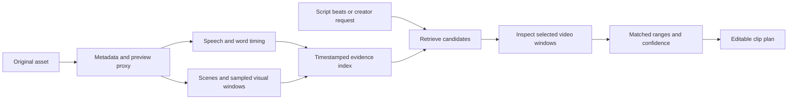

# Efficient text and visual understanding

Status: version-one baseline selected in [technical_stack.md](technical_stack.md); no CreatorAi benchmark yet. Use faster-whisper plus a separate alignment stage, multilingual E5 text retrieval, OpenCLIP frame retrieval, and Gemini inspection of selected temporal windows. Qwen/Lighthouse remain benchmark-driven upgrade options rather than bootstrap dependencies.

## Recommendation

Build a timestamped media index once per asset, then retrieve and inspect only relevant regions. Use inexpensive extraction for broad coverage and a vision-language model for selected temporal windows that require deeper reasoning. Avoid repeatedly passing complete long videos into a general model for every editing request.

The useful intermediate result is a source-linked account of what was said, shown, and when. It serves asset search, script alignment, clip selection, B-roll retrieval, caption timing, and edit provenance. It is not a free-text summary that discards timestamps.



## Layer 1: deterministic media preparation

Use FFmpeg/ffprobe to inspect streams and generate a playback proxy, audio, thumbnails, and waveform. Preserve original presentation timestamps and mappings through any proxy conversion, including rotation, variable frame rate, audio offsets, and frame-rate changes. Source time and output timeline time are different coordinate systems.

Run audio and visual branches independently where resources allow. Cache derivatives by asset content hash plus pipeline version and configuration. Changing a script should not invalidate transcription; changing a trim should not invalidate full-asset understanding.

For upload UX, start metadata and previews early, but do not imply completed analysis until the corresponding jobs succeed.

## Layer 2: speech evidence

[faster-whisper](https://github.com/SYSTRAN/faster-whisper) provides a CTranslate2 Whisper implementation with batching and quantization. Its published benchmark is useful evidence for evaluating it, not a promise of CreatorAi speed on unknown hardware.

[WhisperX](https://github.com/m-bain/whisperX) combines speech recognition with alignment for word timing. Evaluate whether its extra alignment improves cut boundaries and caption sync enough to justify runtime and model dependencies. Add diarization only when interviews or speaker-aware edits need it.

Persist words, sentence/utterance ranges, language, available confidence data, and speaker labels if enabled. Poor audio, code-switching, names, and repeated takes need explicit test cases. Forced alignment can time an incorrect transcript; it does not independently prove transcription accuracy.

## Layer 3: visual evidence

Start with scene detection using [PySceneDetect](https://github.com/Breakthrough/PySceneDetect), then sample representative frames and short temporal windows. Scene boundaries organize evidence; they are not semantic events by themselves.

Proposed sampling policy:

1. Detect cuts and retain multiple representative frames for long scenes.
2. Add sparse periodic coverage so a single uncut recording is not represented by one frame.
3. Increase temporal density around retrieved actions, motion, and suspected transitions.
4. Deduplicate redundant frames and cap resolution/frame count based on the task.

Record the policy and actual timestamps. A fixed sparse frame interval can miss a brief gesture or visual demonstration. Motion-sensitive queries need sequential frames or video windows, not unordered stills.

For cheap image/text retrieval, evaluate [OpenCLIP](https://github.com/mlfoundations/open_clip). For a unified multimodal retrieval route, evaluate [Qwen3-VL-Embedding and Reranker](https://github.com/QwenLM/Qwen3-VL-Embedding), whose official repository supports text, image, and video inputs. The smaller embedding variant is an experiment candidate, not automatically faster than a lighter frame encoder.

OCR can make on-screen labels and slides searchable. Make detectors, face tracking, and OCR conditional rather than loading every vision component for every video. Subject tracking is useful for crops; face identity recognition is unnecessary for the first workflow.

Keep separate text and visual retrieval channels unless the chosen encoder explicitly provides a common embedding space. Do not compare cosine values from unrelated models as if they shared a scale. Merge ranked lists, for example with reciprocal rank fusion; do not average arbitrary uncalibrated scores.

## Layer 4: selective semantic reasoning

Retrieve candidate utterances and visual windows, then ask a vision-language model to inspect only those candidates. It can describe the actual action, check whether a script's demonstration is visible, and assess whether a clip has enough context. Supply ordered media with timestamps and task-specific evidence, not an entire asset library.

Candidate model families include Qwen vision-language models, with [Qwen2.5-VL's technical report](https://arxiv.org/abs/2502.13923) providing useful background on temporal representation. Current model availability, weights, deployment requirements, and license must be checked when selecting the exact checkpoint.

Retain observation and inference separately: a visual model reporting a charging port is different from inferring that the battery is broken. Transcript evidence must not be relabeled as visual confirmation. Silence-only B-roll must remain discoverable without speech.

Model-generated second estimates are candidate boundaries. Refine them against source playback, word timing, and frame timestamps; do not treat them as frame-accurate ground truth.

## Script-to-footage alignment

Split the script into beats with identifiers and types: spoken claim, demonstration, B-roll instruction, hook, CTA. Preserve versions and creator edits.

For each beat:

1. Retrieve spoken-text candidates using lexical and semantic search.
2. Retrieve visual candidates separately for what needs to be shown.
3. Expand candidate ranges to include neighboring sentences and temporal context.
4. Rerank a bounded shortlist; inspect visual windows only when useful.
5. Resolve order, repetitions, and alternate takes using a sequence alignment strategy, with explicit skips and many-to-one matches.
6. Return evidence, alternatives, and unmatched beats rather than forcing every beat to match.

Dynamic programming with semantic match scores and transition penalties is a reasonable prototype for ordered scripts. Allow out-of-order material where footage contains pickups or B-roll. A spoken sentence can align to one take while its supporting visual comes from another range or asset.

Example proposed evidence record:

```json
{
  "beatId": "beat-07",
  "scriptVersion": 3,
  "speechMatch": {
    "assetId": "asset-interview",
    "sourceStartMs": 12400,
    "sourceEndMs": 21800,
    "utteranceIds": ["u-12", "u-13"]
  },
  "visualEvidence": [{"assetId": "asset-demo", "windowId": "w-08"}],
  "alternatives": [],
  "status": "needs-review",
  "confidenceKind": "uncalibrated-ranking-score",
  "reason": "Speech matches; visual demonstration needs review"
}
```

A ranking score is not a probability of correctness. Use creator-facing certainty language only after calibration on held-out examples.

## From alignment to coherent clips

Semantic relevance alone does not make a good clip. Expand ranges to complete thoughts; consider setup, payoff, references to omitted context, sentence boundaries, silence, and duplicated takes. Avoid cutting halfway through words or selecting a punchline without its premise.

Use simple deterministic boundary checks, then a bounded editorial judgment step. Return a few varied candidates with source links and a short reason. Do not invent a virality percentage. A rewritten hook is an overlay or script suggestion unless the creator separately requests synthesized speech; it must not be presented as something the original speaker said.

## Efficiency choices and honest limits

| Choice | Expected benefit | Cost or risk |
| --- | --- | --- |
| Analyze once and cache by version | Repeated requests reuse expensive results | First upload still incurs decoding and inference |
| Preview proxies | Faster UI playback and smaller inspection inputs | Preserve mapping to originals and avoid losing small visual details |
| Adaptive sampling | Less redundant visual processing | Can miss short events; densify uncertain regions |
| Two-stage retrieval then reranking | Expensive reasoning sees fewer candidates | Retrieval misses cannot be repaired by the reranker |
| Batched/quantized inference | Potential throughput or memory improvement | Measure accuracy, warmup, concurrency, and hardware constraints |
| Progressive analysis | Creator can start with partial results | UI must distinguish partial coverage from complete understanding |

For small initial libraries, Postgres full-text search plus [pgvector](https://github.com/pgvector/pgvector) avoids introducing a separate vector service. Begin with exact search on a small dataset; ANN indexing becomes useful when corpus size justifies it. Model dimensions and index support must be checked before choosing an ANN layout.

## Experiments before locking the stack

Build a small creator-footage evaluation set: talking head, interview with repeat takes, tutorial with visible steps, quiet B-roll, noisy speech, and one long uncut shot. Include English and Hindi/code-switching if those are representative of the intended creators. Ask the founder for relevant footage at the implementation stage.

Compare three routes on identical assets and queries:

- **A:** transcript retrieval only, establishing the speech baseline.
- **B:** transcript plus cheap visual retrieval and selected-window inspection.
- **C:** multimodal video embeddings plus bounded reranking/inspection.

Optionally include full-video model analysis as an experimental cost/quality baseline. Record its provider sampling and upload behavior so the comparison is meaningful.

Measure ingest wall time, GPU/CPU and peak memory, cold versus warm query latency, amount of media sent to providers, actual cost, Recall@K, timestamp overlap, boundary error, unmatched-beat quality, and human judgments of clip coherence. Compare first-pass cost separately from subsequent-query cost. Hold out some videos for evaluation and run ablations removing vision and reranking.

Do not select the heaviest model because it tops a public benchmark. Choose the least complex route that meets creator-footage quality and latency needs. Published retrieval benchmarks do not demonstrate this product's finished clip quality.

## Research to study

- [VideoCLIP](https://arxiv.org/abs/2109.14084): background on learning video/text relationships.
- [QVHighlights / Moment-DETR](https://arxiv.org/abs/2107.09609): query-specific moment localization and highlight detection are relevant tasks, not just captioning.
- [Lighthouse](https://github.com/line/lighthouse): practical library for comparing moment retrieval approaches before selecting a specialized model.
- [Edit Mind](https://github.com/IliasHad/edit-mind): existing local-first video indexing and semantic search architecture. Its README says it is not production-ready; study the pipeline and verify its license before copying code.

Our timestamped index, alignment logic, cache strategy, and selective inspection policy are proposed CreatorAi design choices informed by these references, not claims that one paper already implements the entire product.
