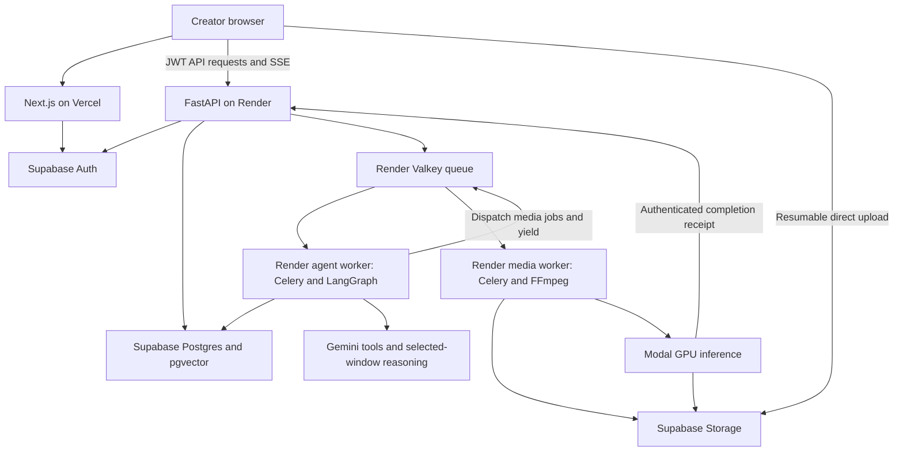

# CreatorAi technical stack — implementation baseline

Architecture baseline selected: 4 October 2026. **Prototype budget update: mostly free; implement incrementally.**

The founder has superseded the paid-hosting assumption below. Read [prototype_budget.md](prototype_budget.md) first. The implemented foundation is Next.js/React/TypeScript, bundled fonts, native CSS, FastAPI/Pydantic, and SQLAlchemy with local SQLite. Other entries in the table are selected future integrations, not installed prerequisites. Docker, brokers, GPU inference, and cloud accounts are deferred. Postgres and tenant authorization are required before public deployment; the local SQLite build is single-user and loopback-only.

This document supersedes the earlier stack shortlist. The selected architecture is the baseline for next-turn implementation. Selection does not mean dependencies are installed, integrations tested, or cloud resources deployed.

Target workload: a small-team web product, modest initial concurrency, and speech-heavy creator footage with real visual evidence. Budget is now confirmed as free-first for the prototype; there is no workload benchmark yet. Preserve service boundaries and data contracts while starting with local adapters; size services after measurement.

## Target integrations (add when their milestone needs them)

| Area | Decision | Responsibility |
| --- | --- | --- |
| Web | Next.js 16, React 19, TypeScript; Node.js 24 LTS and pnpm | App Router, creator workspace, authenticated pages, browser editors |
| UI | Tailwind CSS 4, Radix primitives, Lucide icons, CreatorAi tokens | Accessible interaction mechanics with our own product layout and identity |
| Client data/state | TanStack Query; Zustand for editor document/selection | Server state and caching separate from interactive editing state |
| Script editing | Tiptap open-source core/StarterKit | Editable script beats and hook alternatives; no paid AI/collaboration dependency |
| Upload | Uppy Core + Tus with a custom upload surface | Resumable direct upload to Supabase Storage; retain our visual design |
| Backend | Python 3.12, FastAPI, Pydantic 2, Uvicorn | Business API, validation, authorization, event stream, job submission |
| Persistence | Supabase Postgres + pgvector; SQLAlchemy 2 + psycopg 3; Alembic | Projects, evidence, timelines, revisions, job state, typed migrations |
| Identity | Supabase Auth; Next SSR client; backend JWT verification | Email/Google sign-in, sessions, tenant identity |
| Media storage | Private Supabase Storage buckets | Originals, proxies, waveforms, frames, generated layers, previews, exports |
| Agent runtime | LangGraph Python library + Postgres checkpointer | Stateful tool decisions, bounded refinement, creator review/resume |
| Job execution | Celery 5 stable line + Redis-compatible Valkey | Queueing, execution attempts, retry/backoff; separate agent and media queues |
| Inference | Modal GPU functions with separate pinned ML environment | Open-model speech, embeddings, and selected alignment; warm model/cache management |
| Media preparation/export | FFmpeg + ffprobe + PySceneDetect | Stream inspection, proxies, scene cuts, thumbnails, waveform, deterministic video export |
| Text retrieval | Sentence Transformers with intfloat/multilingual-e5-small | Script/transcript semantic retrieval in a dedicated embedding space |
| Visual retrieval | OpenCLIP ViT-B-32, laion2b_s34b_b79k weights | Cheap frame/text matching; temporal reasoning follows on selected windows |
| Speech | faster-whisper large-v3; WhisperX alignment stage | Multilingual transcription and refined word timing; do not run duplicate ASR passes |
| Reasoning model | Google Gemini API, gemini-3.8-flash via a backend adapter | Script/hooks, editorial decisions, tool calls, selective image/video inspection |
| Optional generated artwork | Gemini image adapter, gemini-3.1-flash-image | Independent background/image assets during the cover milestone; text/layout stay real layers |
| Media editor | React + Konva/react-konva + dnd-kit React | Focused video controls and layered cover canvas around our own project document |
| Live progress | Authenticated fetch-based SSE + resumable event cursor; polling fallback | Reconnectable job/agent progress without exposing broker access |
| Observability | Sentry SDKs plus structured JSON logs and persisted tool/run records | Errors, stage duration, model/tool usage, cost accounting, source-linked debugging |
| Checks | pytest + Ruff; Vitest + Testing Library; Playwright | Relevant backend, document-operation, UI, and end-to-end verification |
| Delivery | Docker, local Compose, GitHub Actions, Vercel, Render, Supabase, Modal | Repeatable build, CI and explicit production service topology |

Exact dependency versions are pinned in pnpm-lock.yaml and uv.lock during bootstrap after compatibility checks. Model weight revisions and container images must also be pinned. Avoid preview model IDs and unbounded `latest` tags. The Gemini endpoint above was verified as stable in the current [official model catalog](https://ai.google.dev/gemini-api/docs/models/gemini-3.8-flash); account access and quotas still need a smoke test.

Initial operational defaults are conservative: one concurrent render per media worker, bounded ffmpeg threads/scratch space, and an explicit cap on Modal GPU containers and model calls per creator run. Set actual caps during the first staging measurement, not from invented throughput figures. Worker concurrency, GPU model batch size and database pool size are separate limits.

Next.js 16.3.8 is installed under apps/web/node_modules/next. Its bundled layout/page, CSS, rewrite, and ESLint guides were read before writing the foundation code, as required by AGENTS.md. Continue reading relevant installed guides for future changes.

## Production topology

Use Vercel for the web application. Use Render Docker services for one API, one agent worker, and one media worker; Render Key Value supplies the Redis-compatible broker. Supabase combines database, identity, and storage in one provider. Modal supplies GPU compute separately so it does not require an always-on GPU attached to the API.

Render documents [background workers and Celery support](https://render.com/docs/background-workers), and its [Key Value service](https://render.com/docs/key-value) is Redis-compatible. Supabase documents [resumable uploads](https://supabase.com/docs/guides/storage/uploads/resumable-uploads) and [pgvector](https://supabase.com/docs/guides/database/extensions/pgvector). Modal documents [asynchronous job processing](https://modal.com/docs/guide/job-queue). These capabilities make the topology deployable; they do not constitute deployment verification.

## Ownership boundaries

**Next.js owns presentation.** It may fetch small page data and manage SSR sessions. It does not run long agent loops, transcribe files, receive complete video uploads, or render MP4s. Browser requests go directly to the authorized API/storage paths where appropriate; no catch-all proxy for media.

**FastAPI owns business rules.** All mutations to projects, edit documents, jobs, and publish state go through it. Do not add a second business backend in Next server actions or an independent Prisma schema. FastAPI publishes OpenAPI; generate TypeScript API types from it. Pydantic and versioned document schemas are authoritative; Zod validates client forms rather than silently creating a competing contract.

**LangGraph owns adaptive run state.** Use the open-source library inside our worker. Do not depend on a separately licensed LangGraph Agent Server or require LangSmith hosting. Postgres checkpoints preserve tool-loop progress and creator review points. Checkpoints are not the media job queue.

**Celery owns execution delivery.** It schedules agent-run segments and fixed CPU/media tasks. Postgres is the product-visible source of truth for jobs; Valkey/Celery states are execution details. Workers may receive a task more than once, so artifacts and side effects are idempotent.

**Modal owns GPU execution.** Dedicated functions receive job/asset references, download authorized derivatives, compute results, and persist immutable artifacts. Celery submission records a remote call ID and returns instead of blocking a worker for the whole inference job. A verified completion callback resumes downstream work; reconciliation handles missing callbacks.

## One example through the system

1. Creator signs in and creates a project through FastAPI.
2. API reserves an owned asset record and authorizes a resumable storage upload. Browser uploads directly, then requests finalize; API verifies the actual stored object before analysis.
3. Media queue generates proxy/audio/scene-window artifacts with timestamp mappings.
4. Modal transcribes and encodes selected frames/text in cached models. Word alignment refines timing using the existing transcript. Results are persisted with model/pipeline versions.
5. Agent worker retrieves script-beat candidates, inspects a bounded shortlist through Gemini, resolves alternate takes, and proposes a typed timeline revision.
6. Creator reviews it and edits the same document. A version check prevents an older AI proposal from overwriting newer edits.
7. Media worker validates the selected revision and renders YouTube/Instagram variants with FFmpeg. Browser receives events and downloads signed exports.
8. Direct publication later uses provider adapters and creator-approved destinations; exports remain available independently.

## Agent and queue integration

Separate queues `agent`, `media`, and `maintenance`, with dedicated worker processes for agent and media. Use a persistent dispatch/outbox record to bridge the database transaction and broker publication. A small periodic dispatcher/reconciler can run in the agent worker service as a supervised process; run only one elected scheduler.

Serialize active graph invocations for the same run with a database lock/lease. Track creator request idempotency keys. On review, checkpoint and end the execution segment; resuming enqueues a new segment against the same run. On waiting for a GPU/media job, checkpoint the expected job and yield. Completion is a typed internal event, not an arbitrary model instruction.

For late-acknowledged idempotent tasks, bound visibility/lease windows relative to hard time limits, use low prefetch for long media work, retry transient errors with limits, and reconcile orphaned jobs. Acknowledgement configuration alone does not guarantee exactly-once work. The [Celery task docs](https://docs.celeryq.dev/en/stable/userguide/tasks.html) explain these retry and worker-loss behaviors.

Model tools are allowlisted functions with schema-validated arguments. The agent cannot run arbitrary shell commands or mutate storage paths. Only trusted media code constructs ffmpeg argument lists. Tool budgets, evidence coverage, and human decisions are saved.

## Text and visual understanding baseline

Choose the inexpensive two-channel route for version one. Text embeddings use multilingual E5; image/query embeddings use OpenCLIP. Keep their vectors separate and merge ranked candidates, not raw scores. Use Postgres exact vector search initially; add ANN indexes after corpus growth warrants it.

The [E5 model card](https://huggingface.co/intfloat/multilingual-e5-small/raw/main/README.md) specifies a 384-dimensional embedding and query/passage prefixes. Use its conventions and respect its input length. Visual embeddings use their own dimension and model version. Store all vectors with tenant, asset/window, and pipeline identifiers.

OpenCLIP's frame retrieval is a candidate generator, not proof of an action over time. Ordered selected video windows go to Gemini when movement, demonstration, or context needs verification. Translate a visual query into an English retrieval description when needed while preserving the original intent; evaluate multilingual visual recall separately from multilingual speech/text retrieval.

Do not install Qwen multimodal retrieval, specialized moment-retrieval models, OCR, diarization, face identity, or segmentation in the first dependency set. They remain upgrade paths if held-out creator footage shows a concrete gap. Selecting a baseline is compatible with evaluating it; quality measurements can justify a documented model change without redesigning the product.

## Editor decision

Own a versioned timeline/scene document and a narrow set of typed commands. Use native video playback for low-resolution proxies, Konva for editable overlays and covers, and dnd-kit for accessible selection/reordering interactions. Read the current [dnd-kit React docs](https://dndkit.com/react/quickstart/) when installing; legacy and current package APIs differ.

Study OpenCut Classic's MIT command/split/history patterns and selectively adapt useful modules with notices. Do not fork its whole archived Next application, depend on OpenCut's unfinished rewrite, or copy AGPL/commercial editor code by default. The focused timeline integration still requires meaningful work; a canvas library is not a complete video editor.

Use FFmpeg to export the supported operations: cuts, reordering, static/manual crop, text/cover overlays, caption layout, and audio levels. Define one timebase and source/output mappings. Browser preview and server export must be compared on representative frames and audio, using the same fonts and document inputs. No claim of perfect parity until tested.

For covers, persist a constrained layer document and export PNG through Konva after ensuring fonts/images are loaded and storage CORS supports canvas export. A generated image layer remains a bitmap; its internal objects are not independently editable. Text and shapes are native layers. Background art generation is a later tool using the same Google provider, not required for the first deployment.

## Auth, progress, and data access

Supabase Auth issues identity tokens. FastAPI verifies signature, issuer, audience, expiry and current signing keys with cached JWKS. Never trust a client-provided user or tenant ID alone. Use separate DB/service credentials for application and maintenance work. All business reads and vector searches apply ownership constraints.

Use private storage buckets, tenant-prefixed paths, appropriate storage RLS and short-lived signed playback/download access. Server service credentials never reach browser bundles. Signed upload authorization reserves a destination and permitted content; finalize verifies size/type/metadata. Secrets for publication are encrypted server-side and never enter prompts.

Keep business/checkpoint tables outside broadly exposed Data API access. If any application table is exposed through Supabase APIs, enable explicit policies; do not mistake JWT validation in FastAPI for automatic Postgres RLS on direct SQL connections. API/worker tenant checks are always required.

SSE uses fetch streaming to permit bearer authentication; native EventSource custom-header assumptions are avoided. Persist numbered run/job events in Postgres. Reconnect using an event cursor and fall back to status polling. Redis notifications can wake streams but are not event history. Closing a browser does not cancel its job; cancellation is an explicit API action.

## Deliberate exclusions

No Kubernetes, Kafka, separate vector database, full editor fork, multiple agent frameworks, always-on GPU, paid editor SDK, or analytics product is needed for the first version. R2 remains a possible storage adapter migration if measured video traffic and Supabase egress cost justify it. Do not configure a second object store now.

## Implementation readiness

Next turn creates the clean monorepo structure and deployment artifacts described in deployment_plan.md. Preserve the docs and any existing work until file-level changes are reviewed in context; building from scratch does not authorize deleting unrelated files. Start with auth, upload and a deployment smoke path before expanding the creator UI.
